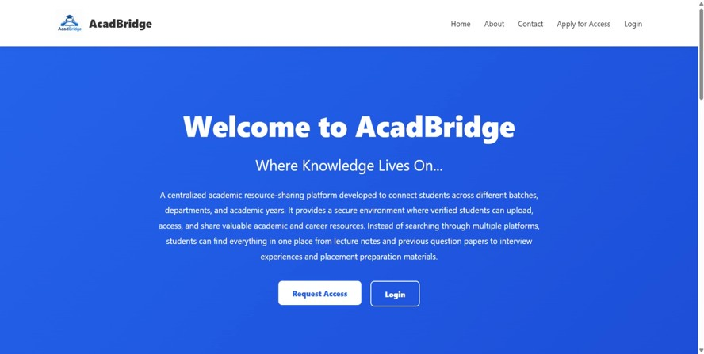
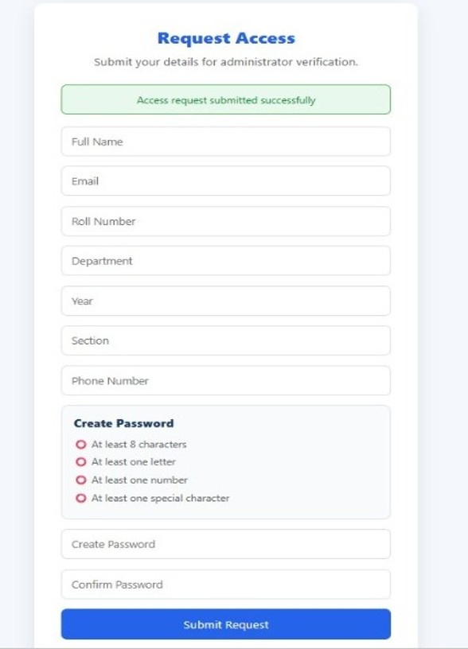
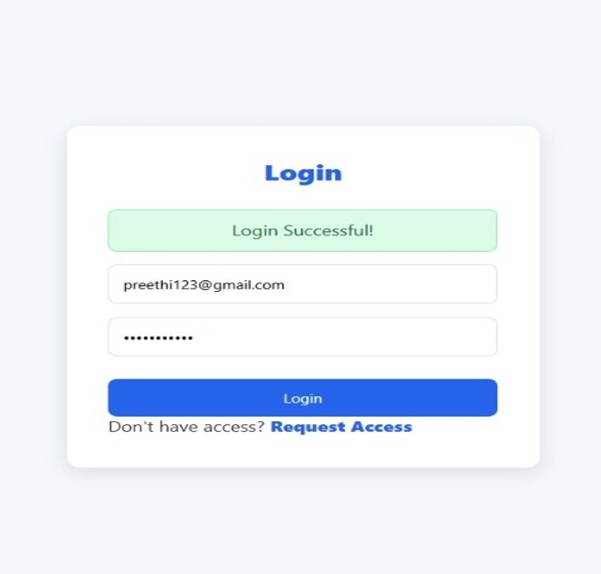
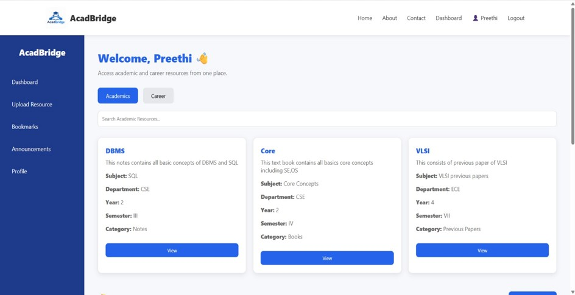
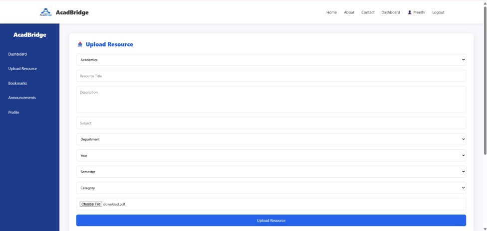
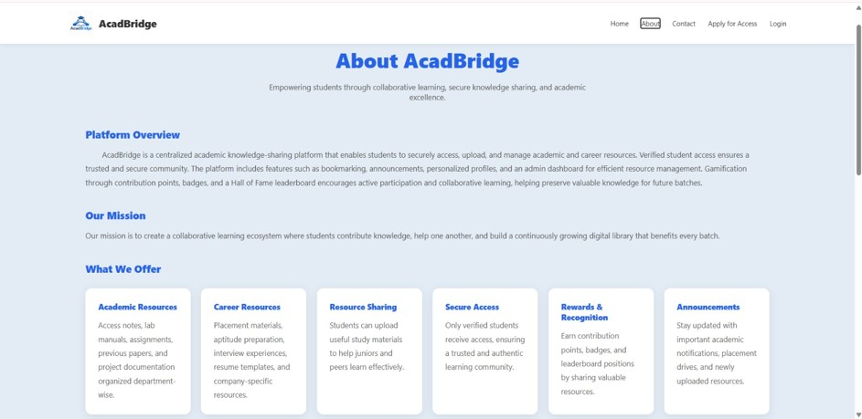
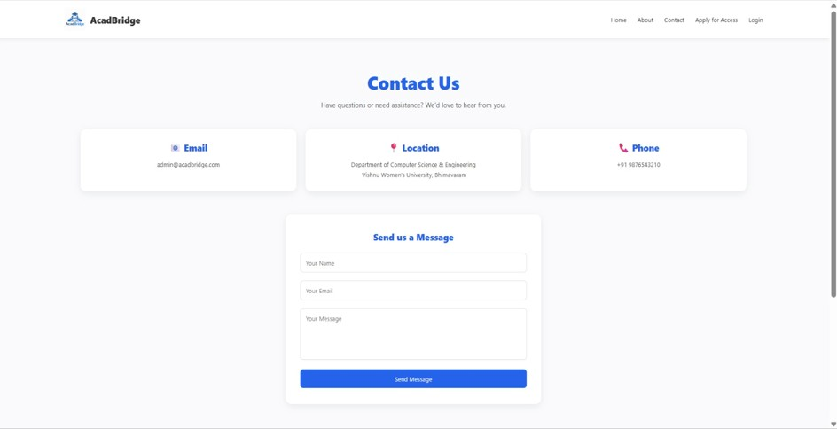
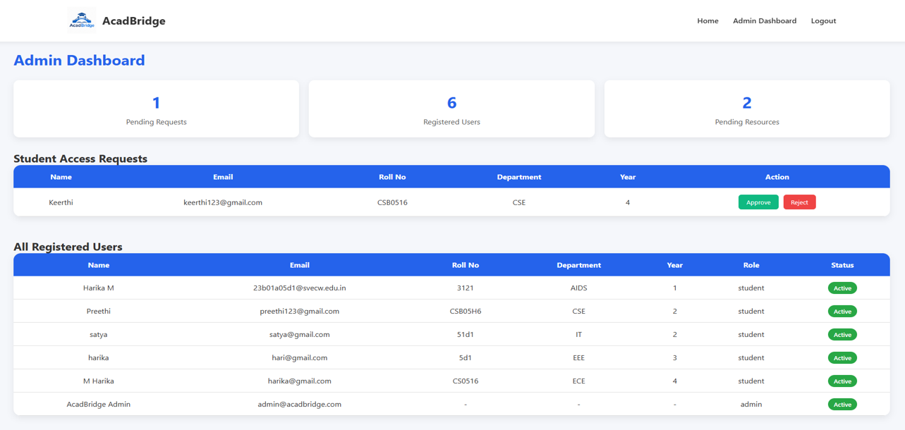

# 🎓 AcadBridge

> A MERN Stack-based Knowledge Retention & Transfer Platform that bridges the gap between senior and junior students by enabling seamless sharing of academic resources, placement experiences, and learning materials.

---

## 📌 Project Overview

AcadBridge is a centralized web platform designed to preserve valuable academic knowledge within an institution. It allows students to upload and access study materials, share placement experiences, and collaborate with peers, ensuring that knowledge is retained across batches.
## 📸 Project Screenshots

### 🏠 Home Page


### 📝 Request Access


### 🔐 Login Page


### 👨‍🎓 Student Dashboard


### 📚 Upload Resource


### ℹ️ About Page


### 📞 Contact Us


### 👨‍💼 Admin Dashboard


---

## ✨ Features

- 🔐 Secure User Authentication
- 📚 Upload & Download Study Materials
- 💼 Placement Experience Sharing
- 📂 Resource Categorization
- 🔍 Search Functionality
- 📊 Student & Admin Dashboard
- 📱 Responsive User Interface

---

## 🛠️ Tech Stack

### Frontend
- React.js
- HTML5
- CSS3
- JavaScript

### Backend
- Node.js
- Express.js

### Database
- MongoDB

### Additional Tools
- Cloudinary
- JWT Authentication
- Git & GitHub

---

## 📂 Project Structure

```
AcadBridge/
├── backend/
├── frontend/
└── README.md
```

---

## 🚀 Getting Started

### Clone the Repository

```bash
git clone https://github.com/M-Haarika/AcadBridge.git
```

### Backend

```bash
cd backend
npm install
npm start
```

### Frontend

```bash
cd frontend
npm install
npm start
```

---

## 🌟 Future Enhancements

- AI-powered resource recommendations
- Real-time discussion forum
- Notification system
- Mobile application
- Analytics dashboard

---

## 👩‍💻 Team

- Haarika M
- Team Members

---

## 📄 License

This project is developed for academic purposes.
